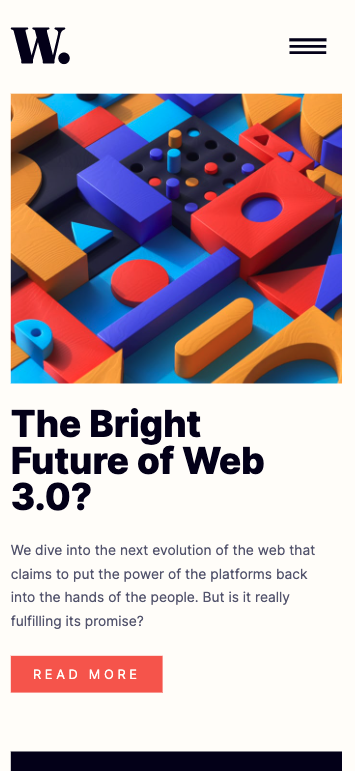
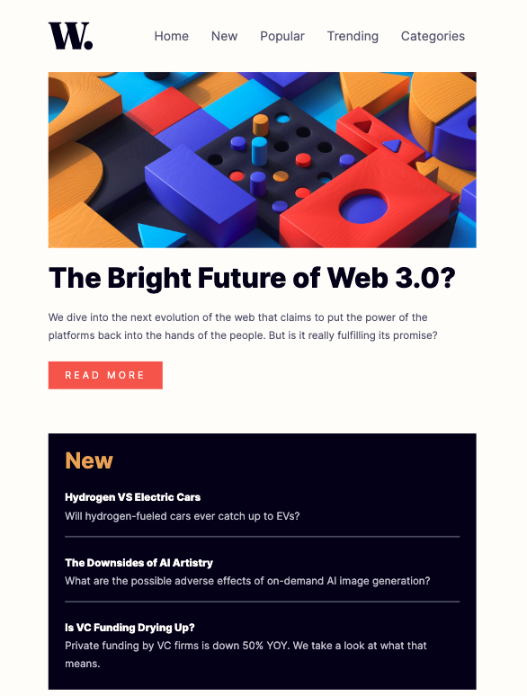
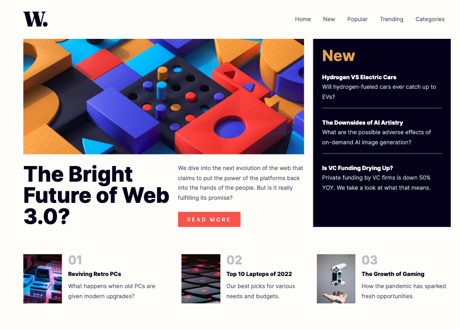

# Frontend Mentor - News homepage solution

This is a solution to the [News homepage challenge on Frontend Mentor](https://www.frontendmentor.io/challenges/news-homepage-H6SWTa1MFl). Frontend Mentor challenges help you improve your coding skills by building realistic projects.

## Table of contents

- [Overview](#overview)
  - [The challenge](#the-challenge)
  - [Screenshot](#screenshot)
  - [Links](#links)
- [My process](#my-process)
  - [Built with](#built-with)
  - [What I learned](#what-i-learned)
  - [Continued development](#continued-development)
  - [Useful resources](#useful-resources)
- [Author](#author)
- [Acknowledgments](#acknowledgments)

**Note: Delete this note and update the table of contents based on what sections you keep.**

## Overview

### The challenge

Users should be able to:

- View the optimal layout for the interface depending on their device's screen size
- See hover and focus states for all interactive elements on the page
- **Bonus**: Toggle the mobile menu (requires some JavaScript)

### Screenshot





### Links

- Solution URL: [Add solution URL here](https://your-solution-url.com)
- Live Site URL: [Add live site URL here](https://your-live-site-url.com)

## My process

### Built with

- Semantic HTML5 markup
- CSS custom properties
- Flexbox
- CSS Grid
- Mobile-first workflow

### What I learned

I learnt a cool trick to not apply css to two different elements at the same time.

To see how you can add code snippets, see below:

```css
.new-section > *:not(:first-child):not(:last-child)::after {
}
```

### Continued development

Persevering to develope my css skills. My goal is to build a strong foundation to develop my skills on.

### Useful resources

- [Example resource 1](https://www.youtube.com/watch?v=rg7Fvvl3taU) - This helped me get started with learning the grid system in css

## Author

- Website - [Basma Tebe](https://basma94tebe.wixsite.com/my-site)
- Frontend Mentor - [@btebe](https://www.frontendmentor.io/profile/btebe)

**Note: Delete this note and add/remove/edit lines above based on what links you'd like to share.**

## Acknowledgments

I would like to thank everyone who has contributed to provide free materials online for those learning to be software developers.
